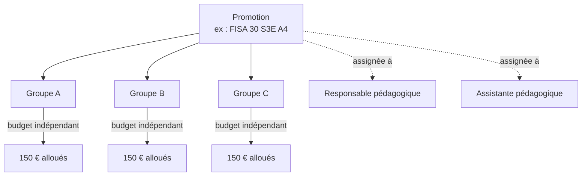
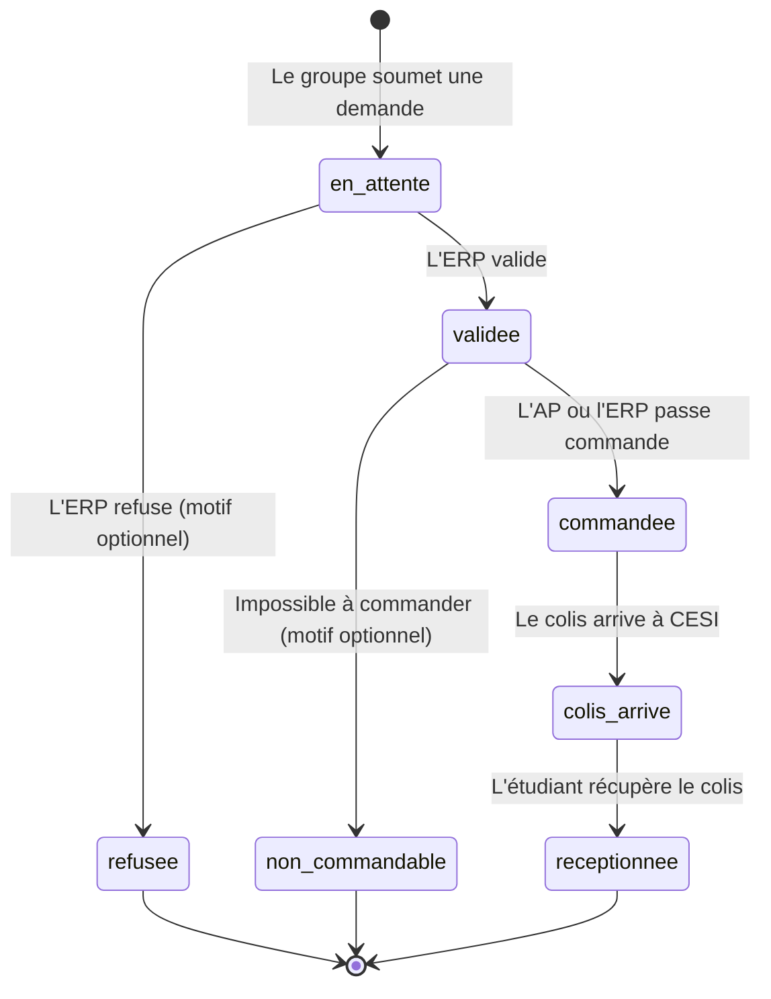
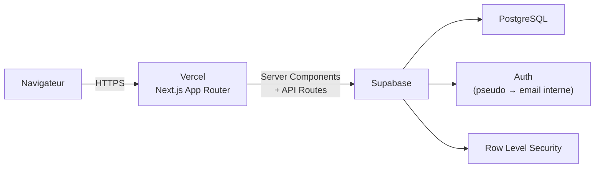
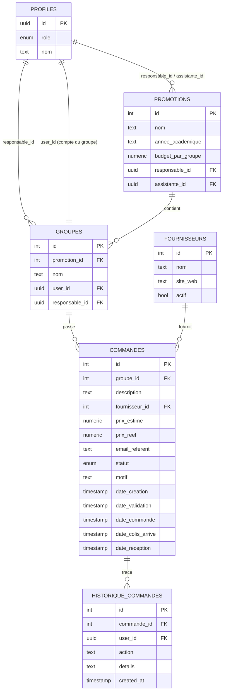
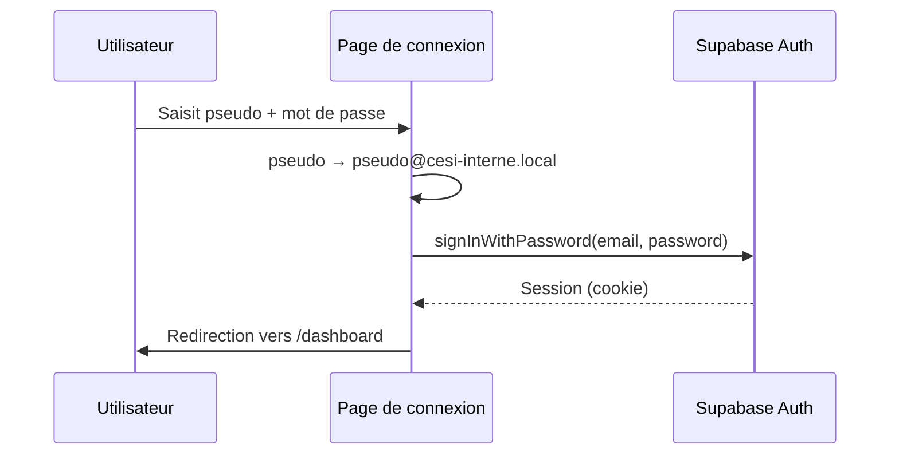

<p align="center">

</p>

# Commandes CESI

Plateforme de gestion des commandes de matériel pour les projets pédagogiques de CESI (SPI, CRI, et autres projets).

**Accès à l'application : [https://commandes-cesi.vercel.app](https://commandes-cesi.vercel.app)**

---

## Sommaire

1. [Présentation générale](#présentation-générale)
2. [Guide d'utilisation](#guide-dutilisation)
   - [Se connecter](#se-connecter)
   - [Les rôles](#les-rôles)
   - [Les promotions et les groupes](#les-promotions-et-les-groupes)
   - [Le cycle de vie d'une commande](#le-cycle-de-vie-dune-commande)
   - [Les statuts en détail](#les-statuts-en-détail)
   - [Le budget](#le-budget)
   - [Les fournisseurs](#les-fournisseurs)
   - [L'export](#lexport)
3. [Architecture technique](#architecture-technique)
   - [Stack](#stack)
   - [Schéma de la base de données](#schéma-de-la-base-de-données)
   - [Authentification](#authentification)
   - [Structure du projet](#structure-du-projet)
   - [Sécurité et permissions](#sécurité-et-permissions)
   - [Déploiement](#déploiement)

---

## Présentation générale

Commandes CESI permet aux groupes d'étudiants de demander du matériel dans le cadre de leurs projets pédagogiques, avec un budget encadré par promotion, une validation par un enseignant responsable pédagogique, et un suivi logistique complet jusqu'à la réception du colis.

Trois catégories de personnes utilisent la plateforme :

- Les **groupes d'étudiants**, qui soumettent des demandes de commande.
- Les **enseignants responsables pédagogiques (ERP)**, qui valident les commandes et gèrent les promotions dont ils ont la charge.
- Les **assistantes pédagogiques (AP)**, qui prennent le relais après validation pour passer les commandes et suivre la logistique.

Un **super administrateur** supervise l'ensemble du système : création des comptes, attribution des responsabilités, gestion globale.

---

## Guide d'utilisation

### Se connecter

L'application se trouve à l'adresse [https://commandes-cesi.vercel.app](https://commandes-cesi.vercel.app).

La connexion se fait avec un **pseudo** et un **mot de passe** (il n'y a pas d'adresse email à saisir). Chaque groupe d'étudiants, chaque ERP et chaque AP dispose d'un pseudo qui lui est propre, transmis lors de la création de son compte.

### Les rôles

| Rôle | Qui | Ce qu'il peut faire |
|---|---|---|
| **Super admin** | Administration CESI | Tout gérer : promotions, utilisateurs, fournisseurs, commandes |
| **Responsable pédagogique (ERP)** | Enseignant porteur du projet | Créer ses promotions, désigner l'AP et les groupes, valider ou refuser les commandes de ses promotions, consulter le budget |
| **Assistante pédagogique (AP)** | Personnel administratif | Passer les commandes validées, suivre la logistique jusqu'à réception, uniquement pour les promotions qui lui sont assignées |
| **Groupe étudiant** | Équipe projet | Soumettre des demandes de commande, suivre l'avancement, consulter son budget |

Un point important : une **AP ne voit et ne peut agir que sur les commandes déjà validées par un ERP**. Elle ne peut pas commander avant que l'ERP n'ait donné son accord (c'est ce qui garantit que chaque dépense est passée par un responsable pédagogique.

### Les promotions et les groupes



Une **promotion** représente une cohorte pour une formation et une année donnée (ex : *FISA 30 S3E A4*). À sa création, l'ERP :

- fixe un **budget par groupe** (ex : 150 € par groupe),
- se désigne lui-même comme responsable (ou est désigné par le super admin),
- assigne une **assistante pédagogique** à la promotion.

Chaque **groupe** correspond à une équipe projet et dispose d'un compte de connexion partagé (un pseudo et un mot de passe transmis à toute l'équipe). Le budget de chaque groupe est totalement indépendant de celui des autres groupes de la même promotion : dépenser tout son budget n'affecte ainsi pas les autres groupes.

### Le cycle de vie d'une commande



1. **Un groupe soumet une demande** : lien produit, description, fournisseur, prix estimé TTC, et l'email du référent étudiant (obligatoirement une adresse `@viacesi.fr`). La plateforme vérifie automatiquement que le prix ne dépasse pas le budget restant du groupe.
2. **L'ERP valide ou refuse.** En cas de refus, il peut préciser un motif, visible par le groupe.
3. **Une fois validée, l'AP (ou l'ERP) passe la commande.** Elle peut alors saisir le **prix réel** payé, s'il diffère du prix estimé (si elle ne saisit rien) le prix estimé est retenu par défaut. Si la commande s'avère finalement impossible à passer, elle peut être marquée **non commandable** (avec motif optionnel) ; elle ne consomme alors aucun budget.
4. **À l'arrivée du colis à CESI**, un bouton permet d'envoyer en un clic un email prérempli au référent étudiant pour l'informer.
5. **Quand l'étudiant vient récupérer le colis**, la commande est marquée **réceptionnée**, c'est l'étape finale.

Le **prix réel** est visible par les ERP, AP et le super admin.

### Les statuts en détail

| Statut | Couleur | Signification |
|---|---|---|
| 🟡 En attente de validation | Ambre | La demande vient d'être soumise par le groupe |
| 🔵 Validée | Bleu | L'ERP a donné son accord, en attente de commande |
| 🟣 Commandée | Violet | La commande a été passée par l'AP ou l'ERP |
| 🟠 Colis arrivé | Orange | Le matériel est arrivé à CESI |
| 🟢 Réceptionnée | Vert | L'étudiant a récupéré son colis - statut final |
| 🔴 Refusée | Rouge | L'ERP a refusé la demande - statut final |
| ⚪ Non commandable | Gris | Impossible à commander après validation - statut final |

Depuis la liste des commandes, il est possible de **masquer les commandes terminées** (réceptionnées, refusées, non commandables) pour ne garder à l'écran que ce qui est encore en cours.

### Actions groupées

Les ERP, AP et le super admin peuvent sélectionner plusieurs commandes à la fois (via des cases à cocher, ou des raccourcis de sélection rapide par statut) et leur appliquer une action commune : valider, commander, marquer colis arrivé ou réceptionner en un seul clic. Il est également possible de filtrer par fournisseur ou par groupe avant d'agir en masse (par exemple, valider toutes les commandes Amazon actuellement en attente).

### Le budget

Un onglet **Budget**, réservé aux ERP et au super admin, donne une vue d'ensemble :

- un **tableau récapitulatif par promotion** (budget alloué, consommé, restant),
- des **graphiques** : répartition consommé / restant, répartition par fournisseur, comparaison entre promotions, barres de progression par promotion.

Le budget consommé est calculé automatiquement : le prix réel est utilisé s'il existe, sinon le prix estimé. Les commandes refusées ou non commandables ne comptent jamais dans le budget consommé.

Un ERP ne voit le budget que des promotions dont il a la responsabilité ; le super admin voit tout.

### Les fournisseurs

La liste des fournisseurs (Amazon, RS Components, GoTronic, etc.) est proposée dans un menu déroulant lors de la création d'une commande. Le super admin et les ERP peuvent ajouter ou désactiver un fournisseur ; seul le super admin peut le supprimer définitivement.

### L'export

Pour le calcul du budget global et la gestion du stock, les ERP et le super admin peuvent exporter l'ensemble des commandes au format CSV (compatible Excel), avec toutes les informations y compris les prix réels, un export auquel les groupes d'étudiants n'ont pas accès.

---

## Architecture technique

### Stack

- **Frontend** : Next.js (App Router) + TypeScript + Tailwind CSS
- **Backend** : Supabase (PostgreSQL, authentification, Row Level Security)
- **Hébergement** : Vercel



### Schéma de la base de données



Une **vue** PostgreSQL (`vue_budget_groupes`) calcule à la volée, pour chaque groupe, le budget consommé (prix réel si disponible, sinon prix estimé, en excluant les commandes refusées et non commandables) et le budget restant.

### Authentification

Supabase Auth exige nativement un email. Comme la plateforme fonctionne uniquement par pseudo, chaque pseudo est converti côté serveur en une adresse email interne invisible pour l'utilisateur (format `pseudo@cesi-interne.local`), utilisée uniquement pour l'authentification technique.



La création de comptes (groupes, ERP, AP) passe par des routes API dédiées utilisant la clé de service Supabase (`service_role`), qui seule permet de créer un utilisateur Auth sans passer par le processus d'inscription classique.

### Structure du projet

```
src/
├── app/
│   ├── login/                     Page de connexion
│   ├── dashboard/
│   │   ├── page.tsx                Tableau de bord (vue adaptée au rôle)
│   │   ├── commandes/               Liste, détail, création de commandes
│   │   ├── promotions/              Gestion des promotions et de leurs groupes
│   │   ├── groupes/                 Vue d'ensemble des budgets par groupe
│   │   ├── fournisseurs/            Gestion des fournisseurs
│   │   ├── utilisateurs/            Création des comptes ERP / AP (super admin)
│   │   ├── budget/                  Tableaux et graphiques budgétaires
│   │   └── export/                  Export CSV
│   └── api/
│       ├── groupes/create/          Création d'un compte groupe (service role)
│       └── users/create/            Création d'un compte ERP / AP (service role)
├── components/                     Composants partagés (Sidebar, StatusBadge…)
├── lib/
│   ├── supabase/                   Clients Supabase (navigateur, serveur, admin)
│   └── utils.ts                    Conversion pseudo → email interne
├── types/                          Types TypeScript partagés
└── middleware.ts                   Protection des routes /dashboard
```

L'application suit les conventions de l'**App Router** de Next.js : les pages sont des Server Components qui lisent directement Supabase côté serveur, et délèguent l'interactivité (formulaires, actions groupées, filtres) à des Client Components dédiés.

### Sécurité et permissions

La sécurité repose sur deux niveaux complémentaires :

1. **Filtrage applicatif** : chaque page adapte sa requête Supabase selon le rôle connu du profil (un ERP ne récupère que les commandes des promotions dont il est responsable, une AP uniquement celles déjà validées, etc.).
2. **Row Level Security (RLS) PostgreSQL** : des politiques au niveau de la base de données garantissent qu'même en cas de contournement du filtrage applicatif, un utilisateur ne peut jamais lire ou modifier des données hors de son périmètre.

Pour éviter les boucles de récursion RLS (une politique sur `profiles` qui interroge `profiles`), la lecture du rôle d'un utilisateur passe par une fonction PostgreSQL `SECURITY DEFINER` (`get_my_role()`), qui court-circuite la récursion tout en conservant le contrôle d'accès.

### Déploiement

Le projet est connecté à un dépôt GitHub et se déploie automatiquement sur Vercel à chaque modification poussée sur la branche principale. Les variables d'environnement nécessaires sont :

| Variable | Rôle |
|---|---|
| `NEXT_PUBLIC_SUPABASE_URL` | URL du projet Supabase |
| `NEXT_PUBLIC_SUPABASE_ANON_KEY` | Clé publique, utilisée côté navigateur |
| `SUPABASE_SERVICE_ROLE_KEY` | Clé privée, utilisée uniquement côté serveur pour la création de comptes |

---

## Auteur

Projet développé par Jules Hamdan, ERP à CESI Toulouse, pour les équipes pédagogiques de CESI afin de simplifier la gestion des commandes pédagogiques.
